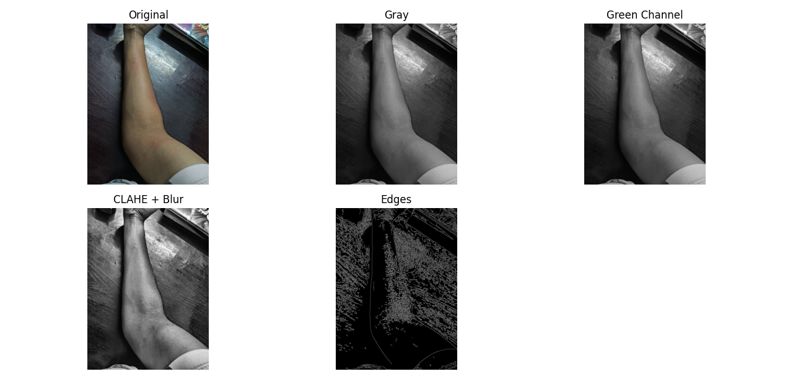

# Vein Detection Using Computer Vision

A Python project to **detect veins in a hand image** using OpenCV and image processing techniques. The repository demonstrates step-by-step processing, from input to edge-detected veins.

---

##  Features

1. Converts the input image to **grayscale**.  
2. Extracts the **green channel** for better vein visibility.  
3. Applies **CLAHE (Contrast Limited Adaptive Histogram Equalization)** for contrast enhancement.  
4. Uses **Gaussian blur** to reduce noise.  
5. Performs **Canny edge detection** to highlight veins.  
6. Displays all intermediate steps for visualization and debugging.

---

##  Requirements

- Python 3.x  
- OpenCV (`cv2`)  
- NumPy  
- Matplotlib  

Install dependencies:

```bash
pip install opencv-python numpy matplotlib
```

##  Usage

1. Place your hand image in the repository folder and name it hand.jpg.

2. Run the script:

   python trial.py


3. The script displays 5 images:
   

**1) Original image

**2) Grayscale image

**3) Green channel extraction

**4) CLAHE + Gaussian blur result

**5) Final edge-detected veins

   ## 4. Example
   
   Input image :  


   Output (vein detection): 


