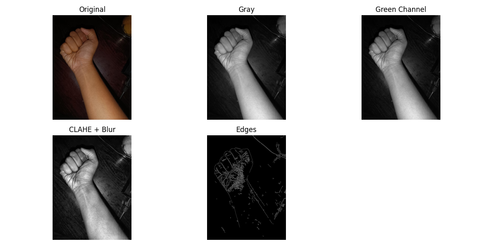
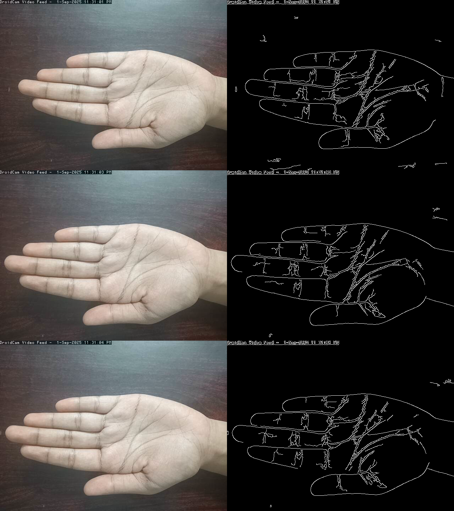

## VeinVision_1

VeinVision_1 is a Python-based project that utilizes OpenCV to detect and visualize veins in hand images. It offers both static image processing and live video capture modes, providing flexibility for various use cases.

## 📂 Project Structure
VeinVision_1/

├── compare.py                                               # Script to generate side-by-side comparisons

├── live.py                                                # Live video capture and vein detection

├── static.py                                              # Static image processing for vein detection

├── static_input.png                                       # Sample input image for static processing

├── static_output.png                                      # Output image showing detected veins

├── captures/                                              # Folder for saving captured images (created during live capture)

└── README.md                                              # Project documentation

## 🖼 Static Image Processing

The static.py script processes a single input image (static_input.png) to detect veins and saves the output as static_output.png. This mode is suitable for testing and demonstrations without requiring a camera.

 *Usage* :

-> Place your input image in the repository directory and rename it to static_input.png.

-> Run the script:

  **python static.py**

-> The output will be saved as static_output.png.

## 🎥 Live Video Capture

The live.py script captures live video from a webcam or IP camera, processes each frame to detect veins, and displays the original and processed images side by side. It also allows manual capture of images during the live session.

 *Features* :

* Manual Capture: Press s to save the current frame and its processed version.

* Auto Capture: Press 1 to start auto-capturing frames for 20 seconds.

* Quit: Press q to exit the live capture.

## Requirements

1. Python 3.x

2. OpenCV (opencv-python)

## Usage

1. Ensure your camera is connected and accessible.

2. Run the script:

   **python live.py**

   Follow the on-screen instructions for capturing images.

   Captured images will be saved in the captures/ folder.

## Examples

### 1. Static Image Processing
Input image:

Vein-detected output:

---

### 2. Live Capture
Run the live script (`live/live.py`) to capture video from your phone camera or webcam.  

Press `1` to start auto-capture for 20 seconds, or `s` for manual capture.  

Captured images are saved in the `outputs/` folder.

During live capture, the left side of the window displays the processed image (veins highlighted), and the right side shows the original frame.

Example of combined original vs detected veins:

## 📌 Notes

The captures/ folder is created automatically during live capture to store images.

Ensure that your camera is properly configured and accessible by OpenCV for live capture functionality.

